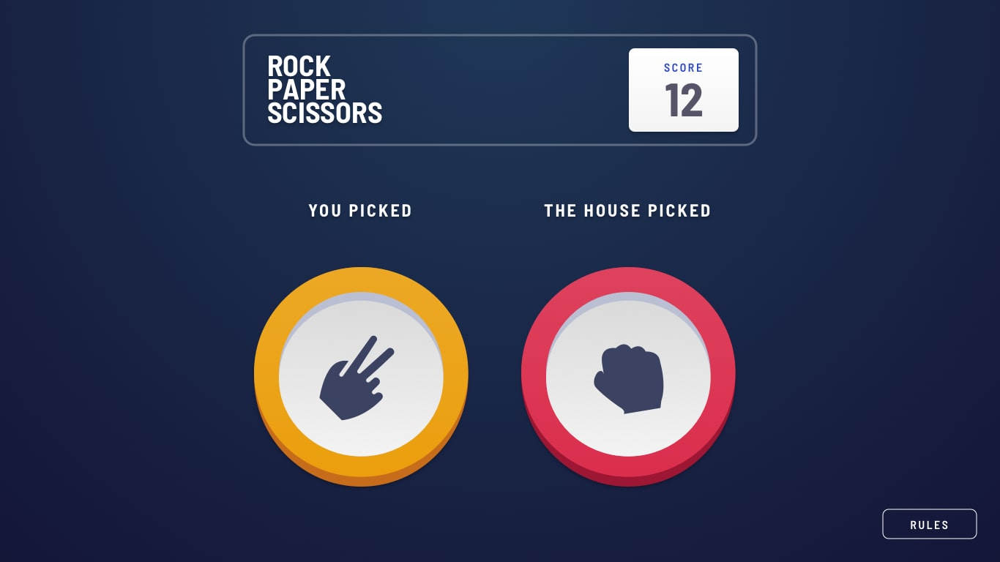

# Frontend Mentor - Rock, Paper, Scissors solution

This is a solution to the [Rock, Paper, Scissors challenge on Frontend Mentor](https://www.frontendmentor.io/challenges/rock-paper-scissors-game-pTgwgvgH). Frontend Mentor challenges help you improve your coding skills by building realistic projects. 

## Table of contents

- [Overview](#overview)
  - [The challenge](#the-challenge)
  - [Screenshot](#screenshot)
  - [Links](#links)
  - [Built with](#built-with)
- [Author](#author)

## Overview

### The challenge

Users should be able to:

- View the optimal layout for the game depending on their device's screen size
- Play Rock, Paper, Scissors against the computer
- Maintain the state of the score after refreshing the browser _(optional)_
- **Bonus**: Play Rock, Paper, Scissors, Lizard, Spock against the computer _(optional)_

### Screenshot

### Links

- Solution URL: [solution](https://www.frontendmentor.io/solutions/rock-paper-scissors-using-react-cs2SvI9ubV)
- Live Site URL: [site](https://rock-paper-scissors-steel-rho.vercel.app/)

## My process

### Built with

- Semantic HTML5 markup
- CSS custom properties
- Flexbox
- CSS Grid
- Mobile-first workflow
- [React](https://reactjs.org/) - JS library

## Author

- Website - [CV](https://cv-frontend-mocha.vercel.app/)
- Frontend Mentor - [@Maxim-Pv](https://www.frontendmentor.io/profile/Maxim-Pv)
- Linked in - [@Maxim_Pavlov](https://www.linkedin.com/in/maksim-pavlov-12b22528b/?locale=en_US)

